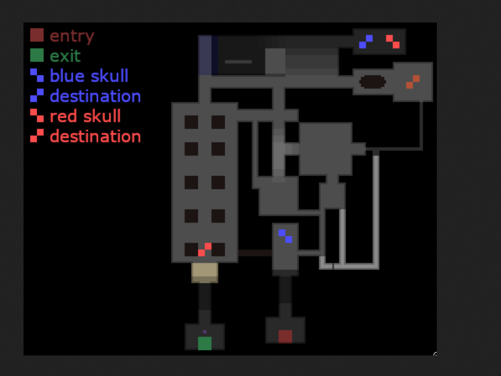

# Trapped Dread

ULTRAKILL Level 0-S Replica

## Description

This project is a replica of the Level 0-S from the game ULTRAKILL, implemented using C++ and OpenGL. ULTRAKILL is a fast-paced first-person shooter game with retro-style graphics and intense action. The Level 0-S is known for its chilling gameplay and unique design, and this project aims to recreate that experience. This project was made as a part of a course "Computer Graphics and Visualisation".

## Features

- First-person gameplay
- Retro-style graphics and effects
- Eerie atmosphere

## Installation

To run the game on your machine, follow these steps:

1. Clone the repository: `git clone https://github.com/TypicalAM/trapped-dread`
2. Navigate to the project directory: `cd trapped-dread`
3. Create a build directory and enter it: `mkdir build && cd build`
4. Compile using `cmake`: `cmake .. && make -j4`
4. Run the compiled executable with one of the maps:

```bash
cd ..
./game ultrakill
./game example
./game parkour
```

Note: Make sure you have the necessary dependencies installed on your system, including OpenGL.

## Controls

- Move forward: W
- Move backward: S
- Strafe left: A
- Strafe right: D
- Jump: Spacebar

## Images

An image of the map:

<p align="center">
    <a href="#">
        
    </a>
</p>

## Acknowledgments

This project was inspired by the game ULTRAKILL, developed by Arsi "Hakita" Patala. The original game can be found at [https://store.steampowered.com/app/1229490/ULTRAKILL/](https://store.steampowered.com/app/1229490/ULTRAKILL/).


